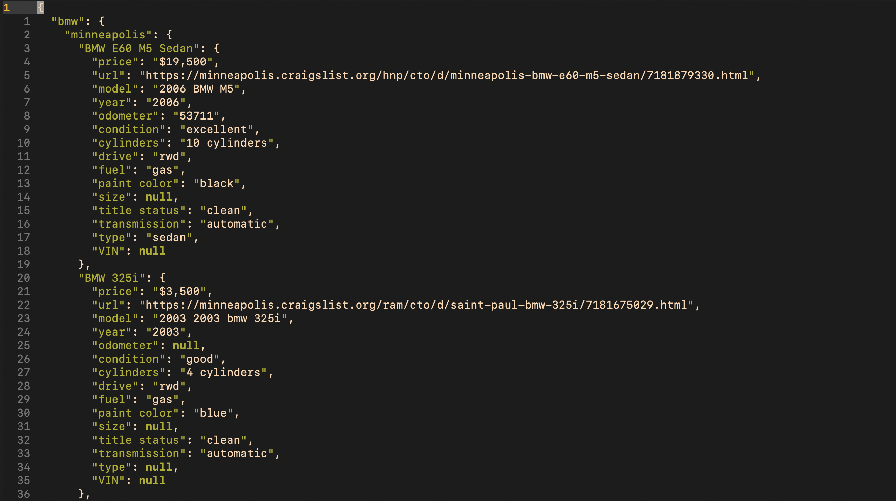

# CraigslistScraper

**Note:** CraigslistScraper is for personal use and data science only.

Craigslist Scraper is a web scraper for craigslist, Users define their searches then Craigslist Scraper pulls all ads and ad data from the defined search and places it neatly inside of a JSON file. The files that are created might look something like: 

```
data
    ├── 14-aug-2020
    │   ├── bmw_14:Aug:2020-11:04:01.json
    │   ├── audi_14:Aug:2020-18:03:21.json
    │   └── iphone_14:Aug:2020-11:04:07.json
    ├── 15-aug-2020
    └── 16-aug-2020
        └── iphone_15:Aug:2020-12:06:02.json
       
```

##### Where each JSON file might contain data that looks like:

<p>
  
</p>
Only tested on macOS with python3.


<!-- TABLE OF CONTENTS -->
Table of Contents
=================

* [Table of Contents](#table-of-contents)
* [Installation](#installation)
* [Usage](#usage)
* [License](#license)


<!-- INSTALLATION -->
## Installation

#### For macOS:

To install the package just run ```pip install craigslistscraper``` in terminal, I recommend the use of Python's virtual enviroments when installing any package whether it be *craigslist scraper* or any other package. For Craigslist Scraper to run properly it needs Beautifulsoup4, Requests, and Pandas. In later updates I plan to have Numpy be included too.

#### Not tested on Windows or Linux


<!-- USAGE -->
## Usage
Example of usage: 
```python
from craigslistscraper import Searches

if __name__ == '__main__':
  filters = ['&postedToday=1'] # Optional

  cities = ['city1', 'city2'] # Required

  foo = Searches("your search", cities "section", filters)
  
  foo.compile_search()
```
**Note #1:** Filters does not have to be defined or passed in as an argument, and will by default be assigned '&postedToday=1'

**Note #2:** For a list of cities view the 'craigslistscraper/city_data/craigslist_cities_list.csv' file

For more filters, check out the 'FILTERS.md' file.

For craigslistscraper to function properly you **NEED** to run it inside of ```if __name__ == '__main__'``` because of a multiprocessing error that occurs if you don't, this will be fixed in a future update.


<!-- LICENSE -->
## License

Distributed under the MIT License. See `LICENSE` for more information.


