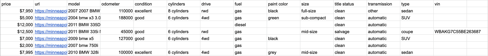
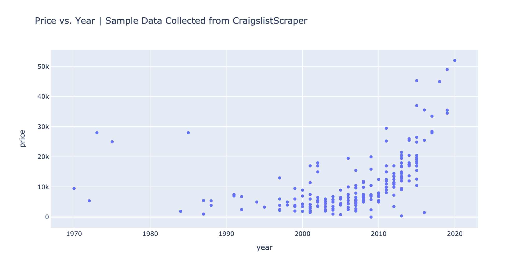
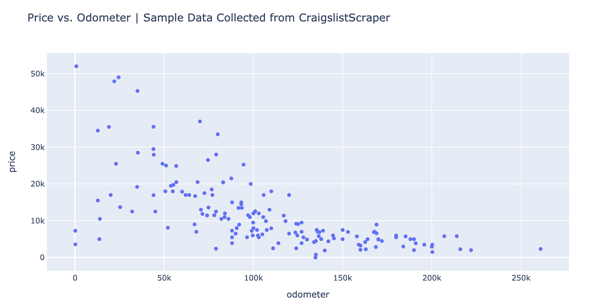

# CraigslistScraper

**Note:** CraigslistScraper is for personal use and data science only.

CraigslistScraper is a web scraper for craigslist. Users define what they would
like to search for then CraigslistScraper pulls ad data from their defined
search and places it neatly inside of a JSON file. The file structure might
look something like this: 

```
data
    ├── 14-aug-2020
    │   ├── bmw_14:Aug:2020-11:04:01.json
    │   ├── audi_14:Aug:2020-18:03:21.json
    │   └── iphone_14:Aug:2020-11:04:07.json
    ├── 15-aug-2020
    └── 16-aug-2020
        └── iphone_15:Aug:2020-12:06:02.json
       
```

##### Where each JSON file might contain data that looks like:

<p>
  
</p>


Only tested on macOS with python3.


<!-- TABLE OF CONTENTS -->
Table of Contents
=================

* [Installation](#installation)
* [Usage](#usage)
* [Analyzing](#analyzing)
* [License](#license)


<!-- INSTALLATION -->
## Installation

### MacOS:

To install the package just run: 

```
pip install craigslistscraper

``` 

I always recommend the use of Python's virtual enviroments when installing
libraries to avoid clutter. The dependencies CraigslistScraper requires to run
properly are Beautifulsoup4, Requests, and Pandas. This may change as I
continue to update this project.

**Not tested on Windows or Linux**


<!-- USAGE -->
## Usage

Example:

```python
from craigslistscraper import Searches

if __name__ == '__main__': # Required to run inside of "if name == main"

  filters = ['&postedToday=1'] # Optional | Define your filters here

  cities = ['city1', 'city2'] # Required | Define the cities you want to search

  # car_data=False by default and doesn't need to be defined explicitly.
  foo = Searches("your search", cities, "section", filters, car_data=False)
  
  foo.compile_search()

```

**Note #1:** Filters does not have to be defined or passed in as an argument, and will by default be assigned '&postedToday=1'


**Note #2:** For a list of cities view the `craigslistscraper/city_data/craigslist_cities_list.csv` file


**Note #3:** For more filters, check out the `FILTERS.md` file.

For craigslistscraper to function properly you **NEED** to run it inside of `if
__name__ == '__main__'` because of a multiprocessing error that occurs if you
don't, this will be fixed in a future update.

If your using this scraper to look at car data I recommend putting `car_data =
True` at the end of foo in the example above, as it'll give more complete json
data which is easier to work with when converting to csv files.


## Analyzing

Data can easily be converted to **CSV**

<p>
  
</p>

This data can then be analyzed, some examples include:

<p>
  
</p>

<p>
  
</p>


<!-- LICENSE -->
## License

Distributed under the MIT License. See `LICENSE` for more information.


